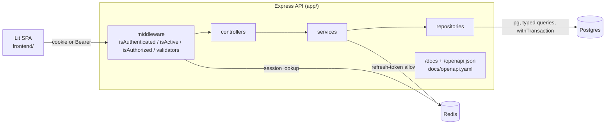

# Bug Tracker

A multi-user issue tracker: an **Express 5 + TypeScript REST API** over Postgres
(raw SQL, no ORM) and Redis, plus a **Lit single-page app**. It supports two auth
transports on every route, Redis cookie sessions for browsers and JWT access +
rotating single-use refresh tokens with reuse detection for API clients. A
hand-written OpenAPI 3 spec is served at `/docs` and checked against the router
in CI.



## Build, test, run

```sh
make install   # pnpm install in app/ and frontend/
make up        # Postgres + Redis via Docker (or point app/.env at your own), then migrate
make test      # API: 350 Jest tests against real Postgres/Redis; SPA: 32 jsdom tests
make lint      # eslint + prettier + tsc for both
make bench     # autocannon: cookie-session vs JWT on an authenticated read
cd app && pnpm dev                 # API on :3000, Swagger UI at /docs
cd frontend && pnpm dev            # SPA on :5173, proxies the API
```

## Results

Measured on `z` (Apple M4 Mini, 10 cores, 16 GB), Node 26, Postgres 18 and
Redis 8 running natively, 2026-10-06:

- `make test`: 350/350 API tests (30 suites, ~5 s) and 32/32 SPA tests.
  Six back-to-back API runs passed. One earlier run had a single failure
  that I could not reproduce.
- `pnpm bench` (GET `/me/assigned-tickets`, 50 connections, 3 alternating
  10 s rounds, medians): **~6,200 req/s with JWT, ~6,400 req/s with
  cookie+Redis, p50 5-6 ms**. The machine was shared (load average ~15), so
  the two transports are within noise of each other. Earlier single runs on
  the same machine reached ~9-10k req/s.
- The OpenAPI spec covers 45 operations on 33 paths. `openapi.test.ts`
  fails if a route is added or removed without updating the spec.
- Production SPA bundle: 48 kB JS (13 kB gzipped).

Learning guide: [docs/LEARN.md](docs/LEARN.md). Resume bullets: [resume.md](resume.md).

## Layout

- [`app/`](app/) — the API. See [`app/README.md`](app/README.md) for setup.
  - `src/routes` → `src/middleware` → `src/controllers` → `src/services` →
    `src/repositories` → Postgres (`pg`, no ORM; baseline schema in
    `app/bugtracker.sql`, forward migrations in `app/migrations/` via
    `pnpm db:migrate`, typed helpers in `app/src/db/`)
  - Session auth backed by Redis (`express-session` + `connect-redis`),
    plus JWT access + rotating refresh tokens (`POST /tokens*`) for API/mobile
    clients; every protected route accepts either transport
  - Route areas: `admin`, `auth` (signup/signin/password + email reset), `me`,
    `project` (projects, members, comments), `ticket` (tickets, assignees,
    comments)
  - Security/logging/compression via `helmet` / `morgan` / `compression`,
    wired in `app/src/config/server.ts`
  - Tests: Jest via `ts-jest` + `supertest` (`app/src/__test__`); docs in
    `app/docs/` (OpenAPI spec: `app/docs/openapi.yaml`); requests scratchpad
    in `app/postman.http`
  - Deploys: `app/Dockerfile`, `app/docker-compose.yaml` (api, postgres,
    redis, pgadmin), K8s manifests in `app/k8s/` (api, frontend, postgres,
    redis)
- [`frontend/`](frontend/) — the Lit SPA (hash router, ReactiveControllers,
  in-memory JWTs with single-flight refresh). See
  [`frontend/README.md`](frontend/README.md).
- [`LICENSE`](LICENSE) — license.

## Workflow

There are different types of users in this app.

A project manager creates a project and then adds users to that project.
Those users can then create and edit tickets and comments.

1. User signup/login
2. User creates a project if they're a PM, or they get invited to join an existing project.
3. User creates tickets in their assigned projects
4. User (dev) closes tickets when they're done working on them.

## Quickstart

Requires Node >= 24.9 for the API test suite (Node >= 22 to run) and pnpm
(see `app/package.json` `packageManager`). No Docker? Run any Postgres 18 and
Redis, load `app/bugtracker.sql`, and set `PG*`/`REDIS_*` in `app/.env`.

```sh
cd app
pnpm install
pnpm ddev   # api + postgres + redis; add pgadmin with `pnpm pgadmin` (port 8080)
pnpm test
```
